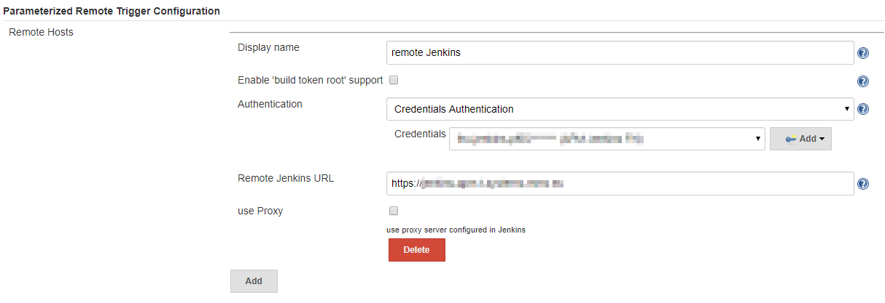
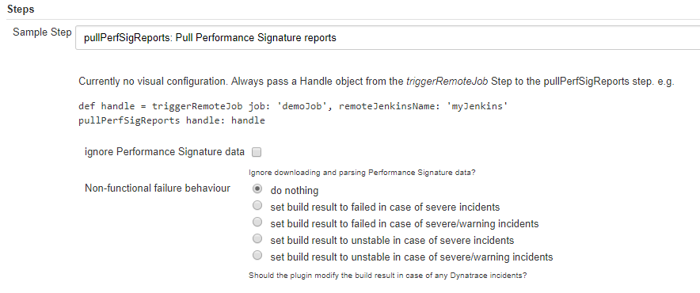

## Performance Signature: Viewer

This Jenkins plugin utilizes the [Parameterized Remote Trigger plugin](https://plugins.jenkins.io/Parameterized-Remote-Trigger) and fetches all Performance Signature data from a remote Jenkins build.
This plugin is a native Jenkins Pipeline plugin without any support for FreeStyle Jobs.

### Installation
#### Using Jenkins Update Center 

The recommended way of installing the plugin is by the Update Center (plugin directory). Navigate to `Manage Jenkins -> Manage Plugins` page and switch to the `Available` tab. Search for the "Viewer" keyword and install the plugin.

#### Manual Installation

This procedure is meant for developers, who want to install locally built plugin version.

* build the plugin from source using `mvn package` command
* in Jenkins, go to `Manage Jenkins -> Manage Plugins` page
* switch to the `Advanced` tab
* upload the built plugin package from `target/performance-signature-viewer.hpi` path in the `Upload Plugin` section
* restart Jenkins

### Configuration
#### Global settings

The global settings for the plugin are located under `Manage Jenkins -> Configure System -> Parameterized Remote Trigger Configuration`. The connection to the remote Jenkins server is configured in this section.



The configured user needs to have the right credentials to be able to trigger a build on the remote Jenkins.
The configured user, needs the following rights:
* Job BUILD
* Job DISCOVER
* Job READ

#### Step configuration

The `pullPerfSigReports` pipeline step needs a `Handle` object from the `triggerRemoteJob` pipeline step.



The following code shows the functionality of the `Handle` object:
```groovy
def handle = triggerRemoteJob job: 'Showcase_Demo/PerformanceSignatureAppMonDemo', remoteJenkinsName: 'remote Jenkins'
pullPerfSigReports handle: handle, nonFunctionalFailure: 1
```

If the remote Jenkins build contains any build artifacts the plugin tries to copy them into the current workspace, so they can be processed by further pipeline logic.

### Examples

```groovy
timestamps {
    node {
        catchError {
            def handle
            stage('trigger remote job') {
                handle = triggerRemoteJob job: 'Showcase_Demo/PerformanceSignatureAppMonDemo', remoteJenkinsName: 'remote Jenkins', shouldNotFailBuild: true
            }
            stage('get PerfSig data') {
                pullPerfSigReports handle: handle, nonFunctionalFailure: 1
            }
        }
        step([$class: 'Mailer', notifyEveryUnstableBuild: false, recipients: 'build@notify.me', sendToIndividuals: false])
    }
}
```
